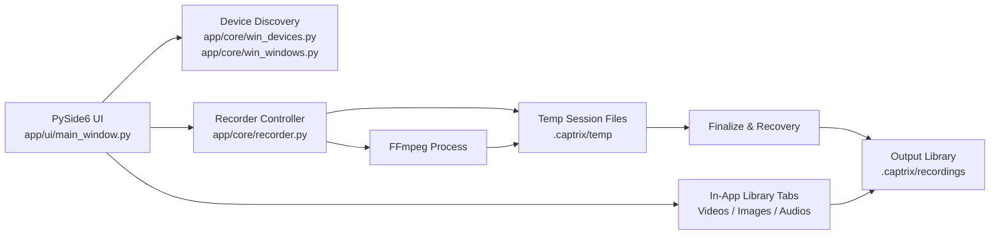
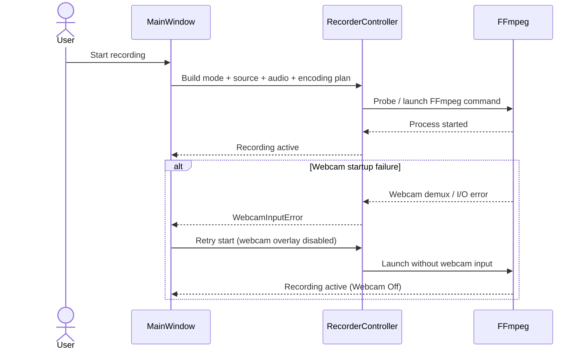
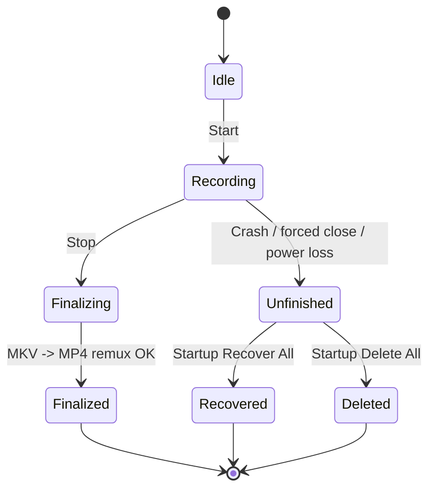

# CAPTRIX

[](https://github.com/Ark-Barua/CAPTRIX/tags)
[](https://www.python.org/)
[](#platform-support)
[](https://pypi.org/project/PySide6/)
[](https://ffmpeg.org/)
[](LICENSE)

CAPTRIX is a Windows desktop recording workstation built with PySide6 and FFmpeg.
It is designed for tutorials, demos, bug reproduction, and general-purpose screen capture with reliable recovery and hardware-aware encoding.

## Table of Contents

- [Why CAPTRIX](#why-captrix)
- [Current Release Highlights](#current-release-highlights)
- [Architecture](#architecture)
- [Core Features](#core-features)
- [Platform Support](#platform-support)
- [Requirements](#requirements)
- [Quick Start](#quick-start)
- [FFmpeg and Encoder Strategy](#ffmpeg-and-encoder-strategy)
- [Data Layout and Recording Lifecycle](#data-layout-and-recording-lifecycle)
- [Build Windows EXE](#build-windows-exe)
- [Troubleshooting](#troubleshooting)
- [Project Structure](#project-structure)
- [Community and Governance](#community-and-governance)
- [License](#license)

## Why CAPTRIX

- Unified capture modes: region, fullscreen, window, game, device, and audio-only.
- Automatic encoder selection with GPU probing and safe CPU fallback.
- Webcam PiP overlay controls with graceful failover behavior.
- Mixed microphone + desktop audio with per-channel level control.
- Crash-safe session model (temp MKV + manifest/lock + startup recovery).
- Built-in media library with file operations and metadata.

## Current Release Highlights

- Encoder mode is auto-managed (`Auto (Best Available)`).
- FFmpeg hardware encoder probing added for:
  - `h264_nvenc` (NVIDIA)
  - `h264_qsv` (Intel QSV)
  - `h264_amf` (AMD AMF)
- GPU vendor-aware auto-priority and fallback to `libx264`.
- Webcam startup fault isolation:
  - If webcam initialization fails, recording retries automatically without webcam overlay.
- Improved About section with a detailed runtime report (view/copy).
- Reliable MKV-to-MP4 finalize flow and startup recovery for unfinished sessions.

## Architecture

### High-Level Component Architecture



### Recording Startup and Fallback Flow



### Session Lifecycle and Recovery



## Core Features

### Capture Modes

- Rectangle Area
- Fullscreen
- Specific Window
- Game Window (60 fps profile)
- Device Recording (camera/capture input)
- Audio-Only Recording

### Webcam Overlay (PiP)

- Enable/disable overlay.
- Device selection.
- Size slider.
- Position presets (top-left/top-right/bottom-left/bottom-right).
- Device/size/position can be configured before enabling overlay.
- Automatic fallback to non-webcam recording if webcam stream fails to initialize.

### Audio Pipeline

- Microphone input (DirectShow).
- Optional system audio via:
  - WASAPI loopback (preferred)
  - DirectShow candidates (fallback)
- Mic/system volume sliders.
- Mix pipeline with timestamp normalization and resampling for long-session stability.

### Recording Reliability

- Temporary recording written as MKV for crash resilience.
- Final MP4 generated on stop via remux/finalize flow.
- Session manifest and lock files for recovery bookkeeping.
- Startup recovery dialog for unfinished sessions.

### In-App Library

- Media tabs: videos, images, audios.
- Filename filter/search.
- Open, rename, delete, reveal in Explorer, open folder.

## Platform Support

- Primary target: **Windows 10/11**
- Capture backends used in this project: `gdigrab`, `dshow`, `wasapi`

## Requirements

- Python 3.10+ (3.11+ recommended)
- FFmpeg:
  - `ffmpeg.exe` (required)
  - `ffprobe.exe` (recommended for duration metadata)
  - Must support inputs used by CAPTRIX (`gdigrab`, `dshow`, `wasapi`)
- Python dependency:
  - `PySide6>=6.10.2`

## Quick Start

### 1) Clone and Install

```powershell
git clone https://github.com/Ark-Barua/CAPTRIX.git
cd CAPTRIX
python -m venv .venv
.\.venv\Scripts\Activate.ps1
pip install -r requirements.txt
```

### 2) Run

```powershell
python main.py
```

## FFmpeg and Encoder Strategy

### FFmpeg Discovery Order

1. `tools/ffmpeg/bin/ffmpeg.exe`
2. `ffmpeg` from system `PATH`

If FFmpeg is unavailable, CAPTRIX disables recording actions and reports setup warnings.

### Encoder Policy (Current Behavior)

- Encoder choice in UI is auto-managed.
- CAPTRIX resolves the effective encoder using:
  - FFmpeg encoder probe (`ffmpeg -encoders`)
  - Host GPU vendor priority detection
  - Optional advisor hook: `app/core/encoder_ai_advisor.py`
- If selected hardware encoder fails to start, CAPTRIX retries with CPU x264.

### Quality Profiles

| Profile | CPU | NVIDIA | Intel | AMD |
| --- | --- | --- | --- | --- |
| Balanced | `libx264 -preset veryfast -crf 23` | `h264_nvenc -preset p4 -cq 23` | `h264_qsv -global_quality 23` | `h264_amf -quality balanced` |
| High Quality | `libx264 -preset faster -crf 20` | `h264_nvenc -preset p5 -cq 19` | `h264_qsv -global_quality 19` | `h264_amf -quality quality` |
| Small File | `libx264 -preset veryfast -crf 28` | `h264_nvenc -preset p3 -cq 28` | `h264_qsv -global_quality 28` | `h264_amf -quality speed` |

## Data Layout and Recording Lifecycle

### Local Runtime Paths

- `C:\Users\<you>\.captrix\settings`
- `C:\Users\<you>\.captrix\temp`
- `C:\Users\<you>\.captrix\recordings` (default output, configurable)

### Session Files

During recording:
- `.captrix/temp/<session_id>.mkv`
- `.captrix/temp/<session_id>.json` (manifest)
- `.captrix/temp/<session_id>.lock` (active lock)

On stop:
- Final MP4 is produced in recordings folder.
- Manifest status updates to `finalized`.
- Finalized temp artifacts are cleaned.

### Recovery

At startup, CAPTRIX scans unfinished sessions and offers:
- **Recover All**
- **Delete All**
- **Later**

## Build Windows EXE

### Onefile Build

```powershell
pyinstaller --noconsole --onefile --name CAPTRIX --icon assets\captrix.ico main.py
```

Output:
- `dist\CAPTRIX.exe`

### Clean Rebuild

```powershell
pyinstaller --clean --noconfirm --noconsole --onefile --name CAPTRIX --icon assets\captrix.ico main.py
```

## Troubleshooting

### FFmpeg Not Detected

- Place `ffmpeg.exe` in `tools/ffmpeg/bin/`
- Or install FFmpeg globally and verify:

```powershell
ffmpeg -version
```

### Webcam Overlay Fails to Start

- Close apps currently using webcam.
- Try another camera device/format.
- CAPTRIX now retries automatically without webcam overlay when needed.

### No System Audio Device Detected

- Ensure FFmpeg build supports `wasapi` input.
- Verify Windows output device is available and not disabled.
- Refresh devices in app after connecting/changing hardware.

### Library Duration Shows `N/A`

- Ensure `ffprobe.exe` is available in FFmpeg install.
- Recording/playback still works without duration probing.

### PyInstaller Icon Error

If you see:
- `ValueError ... icon image ... is not in the correct format`

Your `.ico` may actually be a renamed non-ICO image.

Convert in-place using PySide6:

```powershell
python -c "from PySide6.QtGui import QImage; p='assets/captrix.ico'; img=QImage(p); print('loaded=', not img.isNull(), 'saved=', img.save(p, 'ICO'))"
```

## Project Structure

```text
CAPTRIX/
  main.py
  requirements.txt
  app/
    core/
      ffmpeg.py
      paths.py
      recorder.py
      win_devices.py
      win_windows.py
      encoder_ai_advisor.py
    ui/
      main_window.py
      region_selector.py
      icon_factory.py
  assets/
    captrix.ico
  .github/
    ISSUE_TEMPLATE/
    PULL_REQUEST_TEMPLATE.md
  CHANGELOG.md
  CONTRIBUTING.md
  SECURITY.md
  SUPPORT.md
```

## Community and Governance

- Contributing guide: [CONTRIBUTING.md](CONTRIBUTING.md)
- Code of conduct: [CODE_OF_CONDUCT.md](CODE_OF_CONDUCT.md)
- Security policy: [SECURITY.md](SECURITY.md)
- Support guide: [SUPPORT.md](SUPPORT.md)
- Changelog: [CHANGELOG.md](CHANGELOG.md)

## License

MIT License. See [LICENSE](LICENSE).

